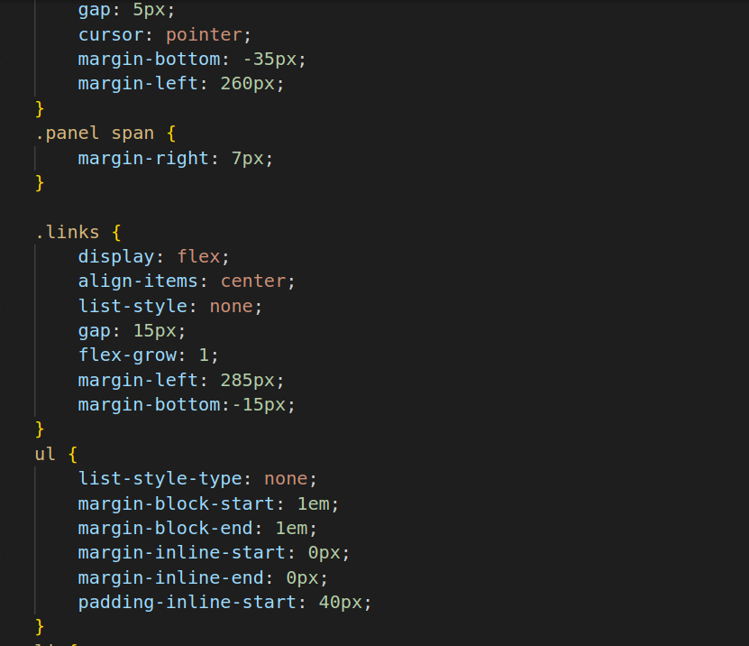

# CSS Properties
1.

2.

* link: This link tag is used to link an external CSS stylesheet for importing custom fonts from Google Fonts.
* link: Another link tag that links an external CSS file named "style.css." This is used to apply custom styles to the HTML content.
* body: The body tag defines the main content of the HTML document, which is what users see in their browsers.
* header: This represents the header section of the web page, typically containing navigation menus, logos, and other header content.
* nav class="navbar": This is a nav element with the class "navbar," which often contains navigation links and menus.
* div class="logo": A div element with the class "logo," which likely contains the logo or branding for the website.
* a href="#": An anchor  element used as a link. The href="#" is a placeholder URL since there's no specific destination.
* img src="...": An img element used to display an image. The src attribute contains the URL of the image to be displayed.
* div class="address": Another div element with the class "address," which might contain address-related information.
* div class="search": A div element with the class "search," usually containing search-related elements.
* div class="sign-in": A div element with the class "sign-in," which likely contains elements related to signing in or user accounts.
* div class="returns": A div element with the class "returns," which may contain information or links related to returns and orders.
* div class="cart": A div element with the class "cart," typically used for elements related to the shopping cart.
* div class="anotherbar": Another div element with the class "anotherbar," which may represent a secondary navigation or menu bar.
* section class="banner": A section element with the class "banner," often used for prominent page sections like banners or hero images.

3.

4.

* section class="shopping": Another section element with the class "shopping," likely used for displaying shopping-related content.
* footer: The footer tag represents the footer section of the webpage, typically containing copyright information, links, and other footer content.
* ul is unordered list .It will contains list items.
* p is used for paragraph text
* a href is anchor tag it contains destinations for source.

5.

6.
* @import: This rule imports an external CSS file from Google Fonts, which contains font styles for "Open Sans" and "Roboto" with specific weights and styles.
* *: This selector applies the following styles to all elements on the page.
* margin: 0; padding: 0;: These styles reset the default margin and padding for all elements to zero.
* box-sizing: border-box;: This property ensures that the element's total width and height include padding and borders, not just the content.
* font-family: "Open Sans", sans-serif;: It sets the default font for all elements to "Open Sans" and then falls back to a generic sans-serif font if "Open Sans" is unavailable.
* header: This selector targets the header element in the HTML.
width: 100%;: This sets the width of the header to 100% of its containing element.
* background-color: #0f1111;: It sets the background color of the header to a dark grayish-blue color (#0f1111).
* .navbar: This class selector targets elements with the class "navbar."
height: 60px;: It sets the height of the navbar to 60 pixels.
* width: 1280px;: It sets the fixed width of the navbar to 1280 pixels.
display: flex;: This property turns the navbar into a flex container.
* align-items: center;: It vertically aligns the content in the center of the navbar.
* justify-content: space-between;: This property evenly distributes the content horizontally, with space between them.
cursor: pointer;: It changes the cursor to a pointer when hovering over the navbar.
* margin: 0 auto;: This centers the navbar horizontally on the page.
* color: #fff;: It sets the text color inside the navbar to white.
* .navbar .logo img: This selector targets images within an element with the class "logo" inside the navbar.
* margin-top: 10px;: It adds a top margin of 10 pixels to the image.
* width: 128px;: It sets the width of the image to 128 pixels.
* .navbar .address: This selector targets elements with the class "address" inside the navbar.
display: flex;: It turns the address element into a flex container.
* align-items: center;: It vertically aligns the content in the center of the address element.
* flex-direction: column;: It arranges the child elements in a column.
* margin-bottom: 0;: It removes any bottom margin from the address element.
* navbar .address .material-symbols-outlined: This selector targets elements with the class "material-symbols-outlined" inside the address element.
* font-size: 16px;: It sets the font size for these elements to 16 pixels.
* margin-bottom: 0;: It removes any bottom margin from these elements.
* .navbar .address .deliver: This selector targets elements with the class "deliver" inside the address element.
margin-left: 20px;: It adds a left margin of 20 pixels to these elements.
* font-size: 0.75rem;: It sets the font size for these elements to 0.75 rem (approximately 12 pixels).
* color: #ccc;: It sets the text color for these elements to a light gray (#ccc).
* a: This selector targets all anchor  elements on the page.
* text-decoration: none;: It removes the default underline from anchor links.
* color: #fff;: It sets the text color of anchor links to white.
* .material-symbols-outlined: This class selector targets elements with the class "material-symbols-outlined."
* font-family: 'Material Symbols Outlined';: It sets the font family to 'Material Symbols Outlined' for these elements.
* font-weight: normal;: It sets the font weight to normal.
f* ont-style: normal;: It sets the font style to normal.
* font-size: 24px;: It sets the font size to 24 pixels.
* line-height: 1;: It sets the line height to 1, meaning it's equal to the font size.
* letter-spacing: normal;: It sets the letter spacing to normal.
* text-transform: none;: It disables text transformation (uppercase/lowercase) for these elements.
* display: inline-block;: It makes these elements inline-block, allowing them to be displayed horizontally in a line.
* white-space: nowrap;: It prevents wrapping of text to a new line.
* word-wrap: normal;: It prevents word wrapping within these elements.
* direction: ltr;: It sets the text direction to left-to-right.

7.

8.

9.

10.

* navbar .search: This selector targets elements with the class "search" that are inside an element with the class "navbar."
* display: flex;: It sets the search container to use a flex layout.
* justify-content: space-evenly;: This property evenly distributes the space between the items in the container.
* max-width: 620px;: It sets the maximum width of the search container to 620 pixels.
* width: 100%;: It ensures that the search container takes up 100% of its parent's width.
* height: 40px;: It sets the height of the search container to 40 pixels.
* border-radius: 4px;: It rounds the corners of the search container with a border radius of 4 pixels.
* .navbar .select-search: This selector targets elements with the class "select-search" that are inside an element with the class "navbar."
* background: #f3f3f3;: It sets the background color of the select-search element to a light gray (#f3f3f3).
* width: 50px;: It sets the width of the select-search element to 50 pixels.
* text-align: center;: It horizontally centers the text content within the select-search element.
border-top-left-radius: 4px; and border-bottom-left-radius: 4px;: These properties round the top-left and bottom-left corners of the select-search element with a border radius of 4 pixels.
* border: none;: It removes any default borders from the select-search element.
* .option: This selector targets elements with the class "option."
font-weight: normal;: It sets the font weight of these elements to normal.
* display: block;: It makes these elements block-level, causing them to stack vertically.
* min-height: 1.2em;: It sets the minimum height for these elements to 1.2 times the height of the font size, ensuring a minimum space for the content.
* padding: 0px 2px 1px;: It sets the padding for these elements with 0 pixels on top, 2 pixels on the right, 1 pixel on the bottom, and 2 pixels on the left.
* .search-input: This selector targets elements with the class "search-input."
max-width: 600px;: It sets the maximum width of the search input field to 600 pixels.
* width: 100%;: It ensures that the search input field takes up 100% of its parent's width.
* font-size: 1rem;: It sets the font size for the search input to 1 rem (approximately 16 pixels).
* border: none;: It removes any default borders from the search input field.
* outline: none;: It removes the default focus outline when the input field is active.
* padding-left: 10px;: It adds 10 pixels of padding to the left side of the input field, creating space between the text and the input's left edge.
* .navbar .search-icon: This selector targets elements with the class "search-icon" that are inside an element with the class "navbar."
* max-width: 45px;: It sets the maximum width of the search icon to 45 pixels.
* width: 100%;: It ensures that the search icon takes up 100% of its parent's width.
* display: flex;: This property sets the search icon container to use a flex layout.
* justify-content: center;: It horizontally centers the content of the search icon container.
* align-items: center;: It vertically centers the content of the search icon container.
* font-size: 1.2rem;: It sets the font size of the search icon to 1.2 rem (approximately 19.2 pixels).
* background: #febd68;: It sets the background color of the search icon container to a yellowish color (#febd68).
* color: #000;: It sets the text color of the search icon to black (#000).
cursor: pointer;: It changes the cursor to a pointer when hovering over the search icon.
* border-top-right-radius: 4px; and border-bottom-right-radius: 4px;: These properties round the top-right and bottom-right corners of the search icon container with a border radius of 4 pixels.
* .sign-in, .returns span: This selector targets elements with either the class "sign-in" or elements that are span elements inside elements with the class "returns."
* font-size: 0.875rem;: It sets the font size for these elements to 0.875 rem (approximately 14 pixels).
* font-weight: 600;: It sets the font weight for these elements to 600, making them bold.
* margin-bottom: 10px;: It adds a bottom margin of 10 pixels to these elements, creating space between them and other elements below.
* .sign-in p, .returns p: This selector targets p elements that are children of elements with the class "sign-in" and elements with the class "returns."
* font-size: 0.75rem;: It sets the font size for these p elements to 0.75 rem (approximately 12 pixels).
* line-height: 0;: It sets the line height of these p elements to 0, effectively collapsing any vertical space they occupy. This might result in the content being visually overlapped or hidden.
* p: This selector targets all p elements on the page.
* display: block;: It sets the display property of all p elements to "block," making them stack vertically, with each paragraph on a new line.
* margin-block-start: 1em; and margin-block-end: 1em;: These properties add a top and bottom margin of 1em (the height of the font in use) to paragraphs, creating space above and below them.
* margin-inline-start: 0px; and margin-inline-end: 0px;: These properties remove horizontal margins from paragraphs, ensuring that there is no extra space on the left and right sides.
* .cart: This selector targets elements with the class "cart."
* display: flex;: It sets the "cart" element to use a flex layout, allowing its children to be arranged in a row or column.
* margin-top: 10px;: It adds a top margin of 10 pixels to the "cart" element, creating space between it and elements above it.
* .cart .cart-icon: This selector targets elements with the class "cart-icon" that are children of elements with the class "cart."
* font-size: 2.5rem;: It sets the font size for these "cart-icon" elements to 2.5 rem (approximately 40 pixels).
* .cart p: This selector targets p elements that are children of elements with the class "cart."
* margin-top: 20px;: It adds a top margin of 20 pixels to the paragraphs within the "cart" element.
* font-weight: 500;: It sets the font weight for these paragraphs to 500, making them semibold.
* .anotherbar: This selector targets elements with the class "anotherbar."
padding: 10px 20px;: It adds padding of 10 pixels on the top and bottom and 20 pixels on the left and right sides of the "anotherbar" element.
* background: #222f3d;: It sets the background color of the "anotherbar" element to a dark blue-gray (#222f3d).
* color: #fff;: It sets the text color of the "anotherbar" element to white (#fff).
* font-size: 0.875rem;: It sets the font size for the text inside the "anotherbar" element to 0.875 rem (approximately 14 pixels).
* .banner-content: This selector targets elements with the class "banner-content."
* margin: 0 auto;: It centers the "banner-content" element horizontally by setting left and right margins to "auto."
* max-width: 1280px;: It sets the maximum width of the "banner-content" element to 1280 pixels.
* display: flex;: This property makes the "banner-content" element a flex container.
* align-items: center;: It vertically centers the content within the "banner-content" element.
* justify-content: space-between;: This property distributes the child elements horizontally with space between them, pushing them to the edges.
* .panel: This selector targets elements with the class "panel."
max-width: 1280px;: It sets the maximum width of the "panel" element to 1280 pixels.
* display: flex;: It makes the "panel" element a flex container.
align-items: center;: It vertically centers the content within the "panel" element.
* gap: 5px;: It adds a gap of 5 pixels between child elements within the "panel" element.
cursor: pointer;: It changes the cursor to a pointer when hovering over the "panel" element, indicating it's interactive.
* margin-bottom: -35px;: It applies a negative margin of 35 pixels to the bottom of the "panel" element, which can affect the layout by pulling elements above it closer.
* margin-left: 260px;: It sets the left margin of the "panel" element to 260 pixels.

11.

12.

13.

14.

* panel span: This selector targets span elements that are children of elements with the class "panel."
margin-right: 7px;: It adds a right margin of 7 pixels to these sapn elements.
* links: This selector targets elements with the class "links."
display: flex;: It makes the "links" element a flex container.
* align-items: center;: It vertically centers the content within the "links" element.
* list-style: none;: It removes the default list-style (usually bullets or numbers) from the "links" element.
* gap: 15px;: It adds a gap of 15 pixels between child elements within the "links" element.
* flex-grow: 1;: It allows the "links" element to grow and occupy available space within its parent.
* margin-left: 285px;: It sets the left margin of the "links" element to 285 pixels.
* margin-bottom: -15px;: It applies a negative margin of 15 pixels to the bottom of the "links" element, which can affect the layout by pulling elements above it closer.
* ul: This selector targets all unordered lists  in HTML document.
* list-style-type: none;: It removes the default bullet points or numbering for list items within the unordered lists.
* margin-block-start: 1em; and margin-block-end: 1em;: These properties add a top and bottom margin of 1em (the height of the font) to the unordered lists, creating space above and below them.
* margin-inline-start: 0px; and margin-inline-end: 0px;: These properties remove horizontal margins from the unordered lists, ensuring there is no extra space on the left and right sides.
* padding-inline-start: 40px;: It adds left padding of 40px to the unordered lists, indenting the list items.
* li: This selector targets all list items  in HTML document.
* display: list-item;: This property sets the display of list items to "list-item," which is the default display value for list items and doesn't need to be explicitly set in most cases.
* text-align: -webkit-match-parent;: This property sets the text alignment of list items to match the parent container's text alignment. However, this property may not be widely supported across all browsers.
* links a: This selector targets anchor elements that are descendants of elements with the class "links."
* padding: 10px 0;: It adds padding of 10 pixels to the top and bottom of the anchor elements within the "links" container, creating space above and below the anchor text.
* .deals: This selector targets elements with the class "deals."
* display: flex;: It sets the "deals" element to use a flex layout.
* display: right;: This line is not a valid CSS property. It seems like there might be a mistake here.
* align-items: right;: This line is also not a valid CSS property. It should be align-items: flex-end; if you want to align items to the bottom.
* white-space: nowrap;: It prevents text within the "deals" element from wrapping to the next line.
* deals a: This selector targets anchor elements that are descendants of elements with the class "deals."
* font-size: 0.9rem;: It sets the font size for the anchor elements within "deals" to 0.9 rem (approximately 14.4 pixels).
* font-weight: 500;: It sets the font weight for the anchor elements within "deals" to 500, making them semibold.
* display: flex;: It sets the anchor elements to use a flex layout.
* align-items: right;: This line is not a valid CSS property. It should be align-items: flex-end; if you want to align items to the bottom.
* margin-left: 1390px;: It sets a left margin of 1390 pixels for the anchor elements within "deals," which might result in them being positioned far to the right on the page.
* banner: This selector targets an element with the class "banner."
height: 400px;: It sets the height of the "banner" element to 400 pixels.
* background-image: url(image.png);: It sets the background image of the "banner" element to an image file named "image.png."
* background-position: center;: It centers the background image both horizontally and vertically within the "banner" element.
* background-size: cover;: It scales the background image to cover the entire "banner" element while maintaining its aspect ratio, ensuring it fills the available space without stretching.
* shopping: This selector targets elements with the class "shopping."
* display: flex;: It sets the "shopping" element to use a flex layout.
* align-items: center;: It vertically centers the content within the "shopping" element.
* flex-direction: column;: It arranges the child elements within the "shopping" element in a column layout, stacking them vertically.
* background-color: #f3f3f3;: It sets the background color of the "shopping" element to a light gray (#f3f3f3).
* padding: 50px 0;: It adds padding of 50 pixels to the top and bottom of the "shopping" element, creating space around its contents.
* shopping-images: This selector targets elements with the class "shopping-images."
display: grid;: It sets the "shopping-images" element to use a grid layout.
* grid-template-columns: repeat(auto-fit, minmax(250px, 1fr));: It defines the grid columns, allowing them to automatically adjust to the available space. Each column has a minimum width of 250 pixels and can expand to fill available space (1fr).
* gap: 40px;: It adds a gap of 40 pixels between grid items.
* max-width: 1280px;: It sets the maximum width of the "shopping-images" element to 1280 pixels.
* width: 100%;: It ensures that the "shopping-images" element takes up 100% of its parent's width.
overflow: hidden;: It hides any content that overflows the "shopping-images" element.
* .shop-link: This selector targets elements with the class "shop-link."
* background-color: #fff;: It sets the background color of the "shop-link" element to white (#fff).
* padding: 30px;: It adds padding of 30 pixels to all sides of the "shop-link" element.
* display: flex;: It sets the "shop-link" element to use a flex layout.
* cursor: pointer;: It changes the cursor to a pointer when hovering over the "shop-link" element, indicating it's interactive.
flex-direction: column;: It arranges the child elements within the "shop-link" element in a column layout, stacking them vertically.
* white-space: nowrap;: It prevents text within the "shop-link" element from wrapping to the next line.
* h3: This selector targets all h3 elements in your HTML document.
* display: block;: It sets the display of h3 elements to "block," which is the default display for headings.
* font-size: 1.17em;: It sets the font size for h3 elements to 1.17 times the current font size, providing a relative size.
* margin-block-start: 1em; and margin-block-end: 1em;: These properties add a top and bottom margin of 1em (the height of the font) to h3 elements, creating space above and below them.
* margin-inline-start: 0px; and margin-inline-end: 0px;: These properties remove horizontal margins from h3 elements, ensuring there is no extra space on the left and right sides.
* font-weight: bold;: It sets the font weight for h3 elements to "bold."
* shop-link h3: This selector targets h3 elements that are descendants of elements with the class "shop-link."
* margin-bottom: 10px;: It adds a bottom margin of 10 pixels to h3 elements within "shop-link" elements, creating space between the heading and the content below it.
* shop-link a: This selector targets anchor a elements that are descendants of elements with the class "shop-link."
* display: inline-block;: It sets the display of anchor elements to "inline-block," allowing them to have block-level styling while remaining inline with other content.
* margin-top: 10px;: It adds a top margin of 10 pixels to anchor elements within "shop-link" elements, creating space between the links and the content above.
* font-size: 0.9rem;: It sets the font size for anchor elements within "shop-link" elements to 0.9 rem (approximately 14.4 pixels).
* color: blue;: It sets the text color of the anchor elements to blue.
* font-weight: 500;: It sets the font weight for anchor elements to 500, making them semibold.
* transition: color 0.3s ease;: It adds a smooth color transition effect with a duration of 0.3 seconds and an easing function when the color of the links changes.

14.

15.

* .shop-link img: This selector targets img elements that are descendants of elements with the class "shop-link."
* width: 100%;: It sets the width of the images to 100% of their parent container, making them responsive and fill the available width.
* height: 280px;: It sets the fixed height of the images to 280 pixels.
* object-fit: cover;: It ensures that the images cover the entire image container, potentially cropping parts of the image to maintain the specified dimensions and aspect ratio.
* margin-bottom: 10px;: It adds a bottom margin of 10 pixels to create spacing between images and content below them.
* img: This selector targets all img elements in your HTML document.
* overflow-clip-margin: content-box; and overflow: clip;: These properties control how overflow (content that exceeds the element's boundaries) is handled for all images. However, "overflow-clip-margin" is not a standard CSS property, and "overflow: clip;" may not be supported in all browsers. It seems like there might be a mistake in these lines.
* shop-link:hover: This selector targets "shop-link" elements when hovered over with the mouse pointer.
transform: scale(1.1);: It scales up the size of "shop-link" elements by 10% when hovered over, creating a zoom-in effect.
* transition: transform 0.4s ease-in-out;: It specifies a smooth transition effect with a duration of 0.4 seconds and an easing function for the scaling transformation, making the change gradual and smooth.
* shop-link:hover a: This selector targets anchor a elements within "shop-link" elements when the "shop-link" elements are hovered over.
* color: #ff4500;: It changes the text color of anchor elements to a specific shade of orange (#ff4500) when the "shop-link" elements are hovered over.
* text-decoration: underline;: It underlines the text of anchor elements when hovered over, providing a visual indication that they are links.
* footer: This selector targets the footer element.
display: block;: It sets the display of the footer element to "block," which is the default display value for block-level elements. This line might not be necessary as the default display for footer elements is already "block."
